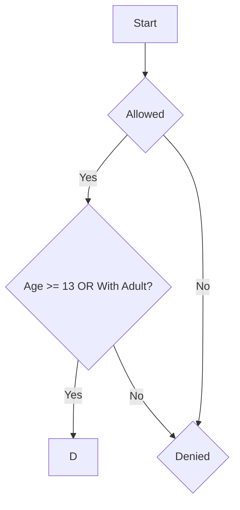

# water park Admission Policy
## water park Users are 13 years old or older, OR
- Users are accompanied by an adult. AND
- Users must have a valid ticket.

## Scenario
The water park checks if the users are allowed to enter or not.
They will be allowed if they satisfy the conditions of age, accompanied by adult, and a ticket.

## Variables
| Variable | Meaning |
|----------|---------|
| A | Age >= 13 |
| B | Accompanied by and Adult |
| C | Valid Ticket |

## Boolean expression 
### Condition 1
Can enter if:
Age >= 13
OR
Accompanied by and Adult

which is:
A OR B

### Condition 2
Must also have a ticket

which is:
(A OR B) AND C

### Truth Table
| A | B | C | A OR B | Admission    |
|---|---|---|--------|--------------|            
| T | F | F |   F    |   Denied     |
|   |   |   |        |              |
| T | F | T |   F    |   Denied     |     
|   |   |   |        |              |
| T | T | F |   F    |   Denied     |     
|   |   |   |        |              |
| T | T | T |   T    |   Allowed    |
|   |  |    |        |              |
| F | F | F |    F   |   Denied     |     
|   |   |   |        |              |
| F | F | T |    T   |   Allowed    |
|   |   |   |        |              |
| F | T | F |    F   |   Denied     |
|   |   |   |        |              |
| F | T | T |    T   |   Allowed    |      
|   |   |   |        |              |

## Flowchart

